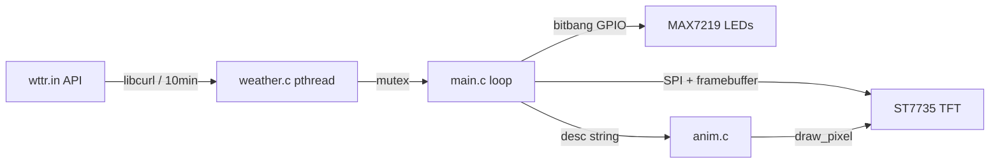

# DeskClock RPi Development Guide

This project is a smart desk clock running on a **Raspberry Pi 1** (BCM2835) with:
- **2x MAX7219** daisy-chained 7-segment LED matrices (dual-timezone clock)
- **1x ST7735** 160x128 TFT display (weather dashboard with animations)

The codebase lives in `src/` and is pure C compiled with `gcc`.

---

## Critical Hardware Rules

> [!CAUTION]
> These rules are **non-negotiable**. Violating them causes hardware-level signal corruption.

### 1. SPI Isolation
The MAX7219 and ST7735 **MUST NOT** share the same SPI bus.
- **MAX7219** → Software SPI (bitbang) on GPIO 17 (DIN), 18 (CLK), 23 (CS)
- **ST7735** → Hardware SPI (`/dev/spidev0.0`) on SPI0

**Why**: MAX7219 runs at 5V logic and injects noise that corrupts the ST7735's 3.3V signals.

### 2. TFT Chip Select
**DO NOT** manually toggle GPIO 22 (CS) for the ST7735 in code.
The Linux kernel manages CS natively via:
```
dtoverlay=spi0-1cs,cs0_pin=22
```
Adding `GPIO_SET`/`GPIO_CLR` for pin 22 conflicts with the kernel driver.

### 3. Font Character Safety
All displayed text must be `.upper()` and filtered to characters in the font arrays.
- `FONT_5X7` in [fonts.h](./references/pinout.md) — used for temperature unit text
- `FONT_8X12` in `font_8x12.h` — used for humidity text
- `FONT_32X48` in `fonts.h` — used for temperature digits

Rendering an unmapped character causes array-out-of-bounds access.

---

## Architecture Overview

```
src/
├── main.c          # Entry point, 10 FPS loop, LED + TFT orchestration
├── tft.c / tft.h   # ST7735 driver (SPI + mmap GPIO for DC/RST)
├── max7219.c / .h  # MAX7219 bitbang driver (mmap GPIO)
├── weather.c / .h  # Background pthread fetching wttr.in via libcurl
├── anim.c / anim.h # Weather animations (sun, rain, snow, cloud, stars, comet)
├── fonts.h         # 5x7 + 32x48 bitmap font arrays (generated from clock.py)
├── font_8x12.h     # 8x12 Consolas-derived font (generated via Pillow)
└── Makefile        # gcc -O3 -std=gnu99, links -lpthread -lcurl -lm
```

### Data Flow



---

## GPIO Pin Map

| Function | GPIO | Pin | Direction | Notes |
|---|---|---|---|---|
| MAX7219 DIN | 17 | 11 | OUT | Software SPI data |
| MAX7219 CLK | 18 | 12 | OUT | Software SPI clock |
| MAX7219 CS | 23 | 16 | OUT | Software SPI chip select |
| TFT MOSI | 10 | 19 | OUT | Hardware SPI0 |
| TFT SCLK | 11 | 23 | OUT | Hardware SPI0 |
| TFT DC | 24 | 18 | OUT | Data/Command via mmap |
| TFT RST | 25 | 22 | OUT | Reset via mmap |
| TFT CS | 22 | 15 | OUT | **Kernel-managed** — do not toggle in code |

---

## Build & Deploy Workflow

### Prerequisites (DietPi)
```bash
sudo apt install build-essential libcurl4-openssl-dev
```

### Build
```bash
cd src
make clean && make
```

> [!TIP]
> Always use `make clean && make` after a `git pull`. The Pi's clock drift can
> cause `make` to skip recompilation because pulled files appear "older" than
> existing `.o` files.

### Run
```bash
./deskclock
```
No `sudo` required — GPIO access is via `/dev/gpiomem`.

---

## Weather Description Matching

Weather descriptions from wttr.in are normalized to uppercase before matching.
The animation engine in `anim.c` uses `strstr()` to match keywords:

| Keywords | Animation |
|---|---|
| `SUN`, `CLEAR` | Day: pulsing sun with rotating rays. Night: twinkling stars + comet |
| `RAIN`, `DRIZZLE`, `SHOWER` | 8 teardrop-shaped raindrops falling |
| `SNOW`, `ICE`, `BLIZZARD` | 4 geometric snowflakes with forked arms, drifting with sine wave |
| *(default)* | Bouncing cloud made of 5 overlapping circles |

---

## Known Pitfalls

| Pitfall | Details |
|---|---|
| **`M_PI` undefined** | DietPi's headers don't expose `M_PI` without `_GNU_SOURCE`. Use `3.14159f` directly. |
| **`localtime()` not thread-safe** | Weather thread and main loop both need time. Use `localtime_r()` / `gmtime_r()`. |
| **`make` skips recompile** | Pi clock drift after reboot. Always `make clean && make` after pulling. |
| **SPI chunk limit** | Linux SPI transfers cap at ~4096 bytes. TFT update blits in chunks. |
| **Bitbang timing** | MAX7219 needs ≥50ns setup/hold. `delay_ns()` volatile loop handles this. |

---

## Adding New Weather Conditions

1. Add a new `strstr()` branch in `anim_draw()` in [anim.c](file:///c:/Users/nathan/Projects/git/deskclock/src/anim.c)
2. Match against **UPPERCASE** keywords from wttr.in descriptions
3. Add corresponding temperature color scheme in `main.c` (the `if/else if` chain around line 108)
4. Test with demo mode: set `DEMO_MODE = true` in `main.c` and add your keyword to the `test_modes[]` array
